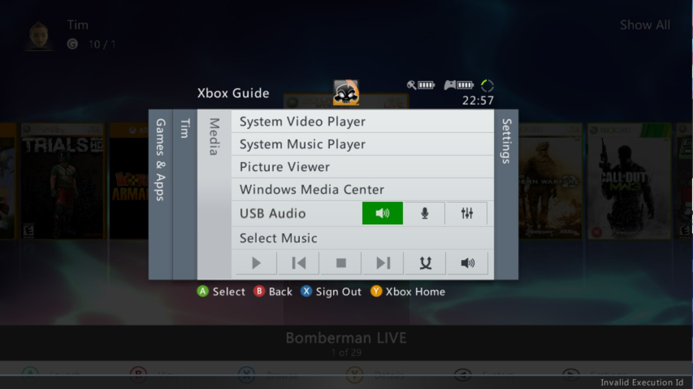
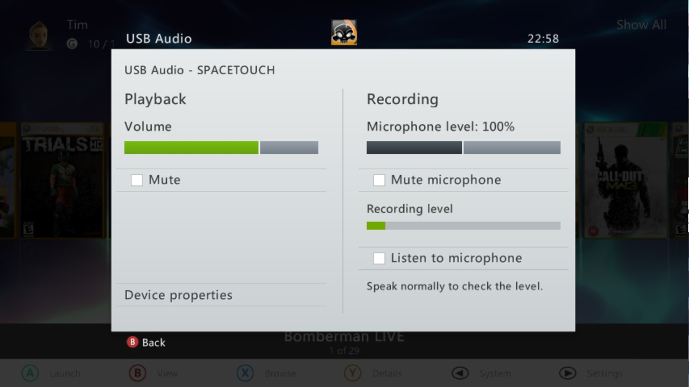
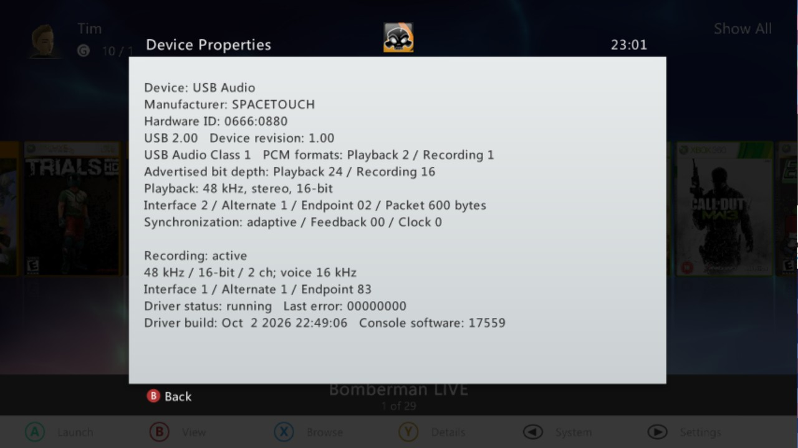

# USB Audio 360

USB Audio 360 adds USB headphone audio and microphone input to a modified
Xbox 360, with controls built into the Xbox Guide. A cheap USB audio adapter
lets you use a computer monitor or other display without speakers or a
headphone socket—no HDMI audio extractor or separate headphone amplifier
required.

The plugin supports descriptor-selected USB Audio Class 1 (UAC1) and USB Audio
Class 2 (UAC2) stereo output at 48 kHz. Compatible UAC1 microphone inputs can
also be presented to games as a wireless headset assigned to player one.

This unofficial DashLaunch plugin requires a modified console, such as RGH,
JTAG, or BadAvatar. It does not work on an unmodified retail Xbox 360.
Read the [warning and recovery instructions](#warning) before installing.

## Audio controls in the Guide

Open **Xbox Guide → Media → USB Audio**. The row sits between Windows Media
Center and Select Music and appears when a supported USB audio device is
connected.



The three icons control **volume**, **microphone mute**, and **settings**.

### Playback and recording

The settings icon opens a native Guide page for output volume and mute,
microphone level and mute, and microphone monitoring.



## Installation

1. Download `usb_audio360.xex` from the latest GitHub release.
2. Copy it to your console, for example as
   `Usb:\Plugins\usb_audio360.xex`.
3. Add it to an unused DashLaunch plugin slot in `launch.ini`:

   ```ini
   plugin2 = Usb:\Plugins\usb_audio360.xex
   ```

4. Connect a compatible USB audio device and reboot the console.

The console displays a notification after audio starts. Only one USB audio
device is used at a time. To switch devices, disconnect the active device,
wait briefly for cleanup to finish, and then connect the next device.

## Tested hardware

| Device | Class | USB ID | Connection | Tested features |
| --- | --- | --- | --- | --- |
| SABRENT AU-MMSA USB External Stereo Sound Adapter | UAC1 | `0d8c:0014` | USB-A | Output |
| Apple AirPods Max USB Audio | UAC2 | `05ac:110c` | USB-A-to-USB-C cable | Output |
| [SPACETOUCH USB Audio](https://www.amazon.com.au/dp/B0GT9K55KX) | UAC1 | `0666:0880` | USB-A | Output and Microphone |
| Sennheiser MOMENTUM 3 Wireless | UAC1 | `1377:6004` | USB-A-to-USB-C cable | Output |

Compatibility is determined from each device's USB Audio descriptors, not
from a device allowlist. Other devices may work, but not every UAC1 or UAC2
format or topology is supported. Testing was performed on retail kernel
`2.0.17559.0`.

## Device information and troubleshooting

Open **Settings → Device properties** from the USB Audio row to see the
device name, USB ID, playback and recording formats, and driver status.
This page is useful when checking compatibility or reporting a problem.



If a device does not work, reproduce the problem once and shut down the
console. Attach **`usb_audio360.log`**, found in the same folder as
`usb_audio360.xex`, to a GitHub issue. A screenshot or photo of Device
Properties is helpful too. The log contains USB descriptors and driver
events, but no captured audio or USB serial-number strings.

## Warning

This is experimental native software. Bugs in the plugin can freeze the
console or prevent it from completing startup. Use it only if you have a
tested recovery path.

If the console does not boot with the plugin enabled:

1. Turn it off and disconnect the USB audio device before starting it again.
2. If that does not help, connect the storage containing the softmod to a
   computer and remove the plugin entry from `launch.ini`.

Development testing was performed on a console modified with BadAvatar.

## AI code-generation disclosure

This project was developed with substantial assistance from generative AI.
AI was used for reverse-engineering hypotheses, implementation, refactoring,
documentation, and build automation under human direction. The behavior was
iteratively reviewed and tested on real Xbox 360 hardware by the project
maintainer. AI-generated code can contain subtle errors; contributors and
users should audit the source and treat native kernel plugins as high-risk
software.

## License

USB Audio 360 is licensed under GPL-3.0-or-later. The PowerPC detour code is
derived from GPL-licensed work; see
[THIRD_PARTY_NOTICES.md](THIRD_PARTY_NOTICES.md).

Build and development instructions are available in
[BUILDING.md](BUILDING.md).
